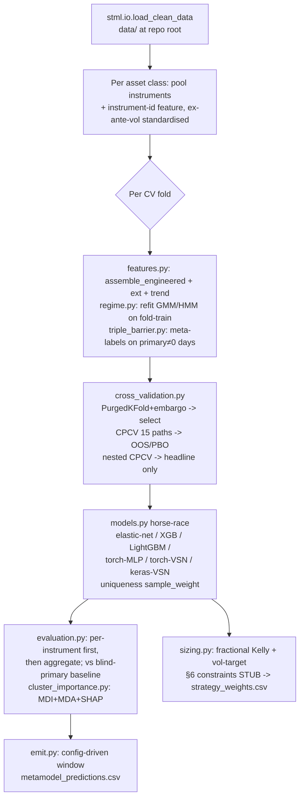

# Plan: T3.03 Alken Meta-Labelling Metamodel (`metamodel-apb/`)

## Context

**Goal.** Build a deterministic, leakage-safe Python project implementing the **meta-labelling metamodel** — a secondary *act/skip* classifier over the provided primary signal — for the 11-instrument T3.03 Alken coursework, covering brief **Sections 1–6 + the +10 bonus**, emitting the required prediction CSV reproducibly. **The grade is methodology, not performance** (`refs/project-instructions.md:182`): every choice is justified against the literature, the feature set is locked before final OOS, and the write-up reports honestly where the metamodel does *not* beat the blind-primary baseline.

**Why now.** The brief (`refs/project-instructions.md`), the triple-barrier guide (`refs/triple_barrier_guide.md`), the PS solution notebooks (`refs/programming-session-sol/`), the **literature review `reports/apb/nlr-cw-v1.md`** (8 commitments, 60 references — the methodological backbone), the **`sts-ml` skill** (`~/.claude/skills/sts-ml/` — canonical runnable `scripts/` + per-lecture `references/`), and the released data (`data/`) are all reachable. stml already supplies the *feature functions*; the five load-bearing modelling pieces — triple-barrier labels, purged/CPCV, cluster SHAP, sizing, evaluation — do not exist yet. **Deadline 4 Jun 2026.**

**Binding facts (verified):**
- Deliverable schema **exactly** `date,instrument,prediction` (P(take)∈[0,1]) for **Jan–Jun 2022** (`refs/project-instructions.md:209-220`). No filename mandated → `metamodel_predictions.csv`. Bonus: `date,instrument,weight` → `strategy_weights.csv`.
- **Hidden test = Jul–Dec 2022**; released data ends **30 Jun 2022** → prediction window must be **config-driven**, never hardcoded.
- Data at repo-root `data/`: `ohlcv_data.csv` (1990→2022-06-30), `primary_signals.csv` (2020-01-03→2022-06-30, {-1,0,+1}), `additional_data.xlsx`. Read-only via `stml.io.load_clean_data()`.
- Universe (lowercase, `stml.io.INSTRUMENTS`): Equity (es1s, nq1s, fesx1s) / Energy (cl1s, ho1s, rb1s, ng1s) / Metals (gc1s, si1s, hg1s, pl1s). Scope = all 11 across 3 asset-class metamodels.

**Decisions (user-confirmed):**
1. **Placement:** nested uv subproject **`metamodel-apb/`** inside this repo, own `pyproject.toml`, importing stml as an editable path dependency.
2. **NN family:** evaluate **all** neural variants — **(a) torch MLP, (b) torch-ported VSN, (c) Keras/TF VSN reused from PS6/`sts-ml`**. torch (CPU) + TensorFlow (CPU) both ship in the subproject env.
3. **§6 bonus:** competing; **20 May constraints doc not in repo** → constraints behind a clearly-marked stub on lit-review defaults (κ=0.25, p̂≥0.55, 25% ann. vol), trivially swappable.
4. **Features:** reuse stml's *causal* feature **functions, recomputed per CV fold** (fold-safe); fitted regime/HMM/latent blocks re-fit on fold-train only. Do **not** consume `results/feature_matrix.parquet` — it freezes regime/HMM/latent/macro stats at a single global `fe_train_end` (`pipeline.py:236-289`), which would leak into in-sample folds before that date.

## Sources folded back in (this sync) — vs the cloud draft

The cloud Ultraplan agent ran in a **repo-only sandbox** and therefore (wrongly) marked two key sources "absent." Both exist on this machine and are now restored:

- **`reports/apb/nlr-cw-v1.md`** (now in-repo) — the **methodological backbone**: 8 commitments, 60 citations. **Restores** the "8 commitments → module" Definition-of-Done item and the citation-backed §-by-§ justification (the part the brief grades hardest, `refs/project-instructions.md:182`).
- **`sts-ml` skill** (`~/.claude/skills/sts-ml/`) — canonical, runnable `scripts/` (cleaner than parsing `refs/programming-session-sol/` notebooks) + `references/L1–L8` for citations. **Vendor** the needed scripts into the subproject so it runs cold (the skill dir is not in the repo the grader re-runs).

Everything else from the cloud draft that is *correctly* repo-grounded is kept: stack is **torch** (stml base already has torch-CPU/shap/xgboost/optuna/sklearn; hmmlearn in `features-extra`); the only genuinely new deps are **lightgbm + tensorflow**; `triple_barrier.py` adapts the LdP snippets already in `refs/triple_barrier_guide.md`.

## The eight methodological commitments → modules (cite `reports/apb/nlr-cw-v1.md`)

| # | Commitment | nlr-cw § / primary citations | Module | Status |
|---|---|---|---|---|
| 1 | **Meta-labelling** secondary act/skip filter over the primary side | §1 — LdP 2018 Ch.3; Joubert 2022 | `triple_barrier.py` + `pipeline.py` | template PS5; **purged CV added** |
| 2 | **Vol-adaptive symmetric triple barriers** ±k·σ̂ₜ + vertical `T_max` | §1 — LdP 2018 Ch.3 | `triple_barrier.py` | adapt `refs/triple_barrier_guide.md` |
| 3 | **Purged CV + embargo ⌈0.01·T⌉ + CPCV(15) + nested** | §6 — LdP 2018 Ch.7/12; Bailey et al. 2014 (PBO/DSR); Harvey-Liu-Zhu 2016 (t>3); Schnaubelt 2022 | `cross_validation.py` | **net-new** |
| 4 | **Garman–Klass volatility** (Parkinson robustness check) | §A1 — Garman-Klass 1980; Korkusuz et al. 2023 | `volatility.py` | wraps stml closed forms |
| 5 | **3-family horse-race** elastic-net logistic / LightGBM / VSN | §2 — Gu-Kelly-Xiu 2020; Krauss et al. 2017; IKM 2020 (small-data restraint) | `models.py` | PS4/PS5/PS6 + add logistic/LightGBM |
| 6 | **Cluster-level importance** MDI + MDA + **SHAP**, Mantegna √(1−\|ρ\|) | §5 — cluster MDI/MDA: LdP 2020 Ch.6; TreeExplainer: Lundberg et al. 2020; distance: Mantegna 1999; **cluster-SHAP: team contribution (no peer-reviewed finance antecedent)** | `cluster_importance.py` | PS2/`sts-ml`; **cluster SHAP is the contribution** |
| 7 | **Fractional Kelly** κ=0.25 + floor p̂≥0.55 + vol-target 25% | §7 — Kelly 1956; MacLean-Ziemba-Blazenko 1992; Carver 2015 | `sizing.py` | **net-new** |
| 8 | **Regime features** 2-state Gaussian HMM, **EWMA time-varying params** | §4 — Hamilton 1989; Nystrup-Madsen-Lindström 2017; Ang-Timmermann 2012 | `regime.py` | adapt stml `fit_hmm`/`fit_regime` |

**Cross-cutting (also from nlr-cw):** sample-uniqueness weights from label concurrency (§1, LdP Ch.4); class weighting for ~30–40% positive share (§1); **calibration** Brier/ECE alongside AUC, Platt/isotonic for NNs (§2, Gramegna-Giudici 2021); **deflated Sharpe / multiple-testing** note (§6, Harvey-Liu-Zhu t>3).

## Reuse map (in-repo + vendored `sts-ml`, verified)

| New module | Primary source | Notes |
|---|---|---|
| `triple_barrier.py` | `refs/triple_barrier_guide.md` §4 (LdP `get_events(..., side=)`, `add_vertical_barrier`, `get_bins`, uniqueness) | meta-label path; symmetric ±k·σ̂ₜ; record `t1`; uniqueness weights (LdP Ch.4). x-ref `sts-ml/references/L1`. |
| `volatility.py` | stml `features.py:290-302` (Parkinson/GK) + `features_ext.py:139` (Rogers–Satchell) | thin wrappers + known-value tests (§2 self-containment). |
| `features.py` (§1) | stml `assemble_engineered` (`features.py:708`), `features_ext`, `stml.io`; **`sts-ml/scripts/trend_scanning.py`** (`trend_labels(look_forward=False)` backward-trend feature) | call **inside each fold** on fold-train; + per-class futures features (nlr-cw §3). |
| `regime.py` | stml `fit_regime/transform_regime` (`regime_features.py:151,307`), `fit_hmm/transform_hmm` (`regime_features_hmm.py:124,206`) | re-fit per fold; **2-state Gaussian HMM + EWMA TV params** (Nystrup 2017). |
| `cluster_importance.py` | **VENDOR `sts-ml/scripts/cluster_feature_importance.py`** (`OptimalClusterer`, `compute_spearman_distance_matrix`, cluster MDI/PFI) | apply **bug fixes #2 (`:105`) + #4 (`:30`)** while vendoring; **add cluster SHAP (#3)**. |
| `models.py` neural | **VENDOR `sts-ml/scripts/vsn.py`** (Keras `VariableSelectionNetwork`/`GatedLinearUnits`/`GatedResidualNetwork`/`InputTransformation`) + torch MLP + torch-VSN port | all CPU-only. |
| `models.py` trees/linear | PS5 `evaluate_model`; PS4 grids | elastic-net logistic + XGBoost + LightGBM; **bug fix #1**. |
| `cross_validation.py` | **net-new** (stml `splits.py` has only chronological+embargo) | PurgedKFold+embargo, CPCV(N=6,k=2→15), nested CPCV (LdP Ch.7/12). |
| `sizing.py`, `evaluation.py`, `emit.py`, `pipeline.py` | **net-new** (PS5 `evaluate_model` seeds eval) | sizing/backtest/CSV/orchestration. |

## The four bug fixes (each points to real code)

1. `max_features: ['auto',…]` (PS4 grid) → drop deprecated `'auto'`; `'sqrt'/'log2'` in tree grids.
2. `KFold(n_splits=cv, shuffle=True, …)` at **`sts-ml/scripts/cluster_feature_importance.py:105`** (`calculate_cluster_importance_pfi`) → our **PurgedKFold** for cluster MDA on overlapping labels. (PS4 tuning `TimeSeriesSplit` → purged/CPCV likewise.)
3. **No real SHAP** in PS2/`sts-ml` (MDI + PFI only) → implement **cluster SHAP** via `shap.TreeExplainer`, summing member contributions per cluster (LdP 2020 §6.5.2 covers MDI/MDA only → cluster-SHAP is the write-up contribution, nlr-cw §5).
4. Distance `1 - np.abs(corr)` at **`…cluster_feature_importance.py:30`** → **Mantegna √(1−\|ρ\|)** (Mantegna 1999; LdP 2020); replace the `*abs(corr)*0.5` redistribution heuristic with the additive cluster-SHAP decomposition.

## Scaffold & tooling (Stage 0)

- `metamodel-apb/pyproject.toml` (uv): `numpy pandas scikit-learn xgboost lightgbm hmmlearn shap optuna torch tensorflow pyarrow`; `stml = { path = "..", editable = true }` under `[tool.uv.sources]`; torch pinned to CPU index (mirror stml `[[tool.uv.index]] pytorch-cpu`); TF CPU wheel. dev: `pytest ruff`. Python ≥3.12.
- Package `metamodel-apb/src/alken_metamodel/`; **vendor** dir `…/alken_metamodel/_vendor/` for `vsn.py`, `cluster_feature_importance.py` (bug-fixed), `trend_scanning.py`, `regression_metrics.py` — each with an attribution header citing `sts-ml/scripts/`. Mirrored `tests/`.
- `metamodel-apb/CLAUDE.md`; commit this plan to `metamodel-apb/docs/plans/2026-05-30-metamodel-build.md`; `nlr-cw-v1.md` already at `reports/apb/`. `.gitignore` for `outputs/`.
- **Determinism:** seed `random`, `numpy`, `torch` (`use_deterministic_algorithms(True)`), `tensorflow` (`tf.config`/`tf.random`), `PYTHONHASHSEED`. Scalers/estimators fit on train only; every lag/rolling feature shifted. CSV emitter sorts rows, pins column order, fixes float format → byte-identical re-emit.
- **Branch:** dedicated branch off the current branch — **never commit to `main`** (stml convention); open a **draft PR**.
- **Ruff caveat:** verify with `uv run ruff check --no-fix` (a global `fix=true` could otherwise mutate the tree — see memory `ruff-global-autofix`).

## Pipeline shape

## Modules to create (`metamodel-apb/src/alken_metamodel/…`)

- `volatility.py` — GK (overnight-gap aware) + Parkinson + Rogers–Satchell; σ̂ₜ for barriers (§2) and vol-targeting (§6). Wraps stml closed forms (nlr-cw §A1).
- `triple_barrier.py` — adapt guide snippets: symmetric ±k·σ̂ₜ + vertical `T_max`; **label only primary≠0 days** via `side=`; **record `t1`**; concurrency uniqueness weights (LdP Ch.4).
- `cross_validation.py` — `PurgedKFold`(+embargo ⌈0.01·T⌉ via `t1` spans), `CPCV`(N=6,k=2→15), `nested_cpcv`.
- `sizing.py` — fractional Kelly `f*=(p̂·b−(1−p̂)·d)/(b·d)`, κ=0.25, floor p̂≥0.55; vol-targeting overlay (25% ann.). Constraints behind a marked stub.
- `features.py` — §1 technical (shifted) + per-class futures features + backward-trend feature + GMM/HMM regime probs, all via reused functions per-fold.
- `regime.py` — GMM regime probs + 2-state Gaussian HMM with EWMA TV params, re-fit per fold.
- `cluster_importance.py` — Mantegna √(1−\|ρ\|) → `OptimalClusterer` → cluster MDI + MDA(purged) + **cluster SHAP**.
- `models.py` — six estimators; tuned via purged→nested CPCV; class weights + uniqueness `sample_weight`.
- `evaluation.py` — PS5 `evaluate_model` on purged OOS; precision/recall/F1/AUC, confusion matrix + threshold sweep; **per-instrument before aggregate**; blind-primary baseline; deflated-Sharpe note.
- `pipeline.py` — orchestration, **one per asset class** (Equity/Energy/Metals), pooled-with-instrument-id, ex-ante-vol-standardised.
- `emit.py` — two deterministic CSV emitters; **config-driven window**.

## Sections 1–6 wiring (with nlr-cw citations)

- **§1 (20):** technical block (multi-horizon returns, realised vol, momentum, MA-cross, RSI, vol/OI changes — all shifted) + **theory-of-storage futures features** (log calendar/basis spread, OI growth — nlr-cw §3, Hong-Yogo 2012; Energy GK vol + overnight-gap §A1; Metals basis + gold↔real-rates/USD, copper↔China-PMI §3; Equity VIX level/term-slope/VRP §3 — *include where derivable from `additional_data.xlsx`, flag where not*) + backward-trend feature + GMM + 2-state HMM regime probs; one-line "what it captures" per feature.
- **§2 (20):** triple-barrier; justify k·σ̂ (GK) **and** `T_max` in prose (LdP 2018 Ch.3); `t1` recorded; uniqueness weights (Ch.4) + per-instrument class balance.
- **§3 (30):** six tuned estimators; purged→nested CPCV; AUC/`neg_log_loss`; class weights; uniqueness `sample_weight=`; comparison table + ROC overlay; pick by **test AUC + calibration (Brier/ECE)** — calibration matters for Kelly (nlr-cw §2); Platt/isotonic for NNs; VSN-only not full TFT (IKM small-data, §2/§A2).
- **§4 (10):** √(1−\|ρ\|)→`OptimalClusterer`→cluster MDI + MDA(purged) + **SHAP**; discuss feature *groups*; noise clusters ≈0; foreground cluster-SHAP as a contribution (nlr-cw §5).
- **§5 (20):** purged OOS metrics; confusion matrix + threshold sweep; **per-instrument before aggregate**; blind-primary baseline; purge+embargo via `t1`; **deflated-Sharpe / multiple-testing** (Harvey-Liu-Zhu t>3, nlr-cw §6).
- **§6 (+10):** `primary×take`→L/S/N, size by p̂ (fractional Kelly) + vol-targeting (nlr-cw §7); backtest metrics (CAGR/vol/Sharpe/Sortino/maxDD/holding/turnover); **constraints stub**; emit `strategy_weights.csv`.

## Validation protocol (right-sized to small N)

~520 signal-days/class, fewer after triple-barrier overlap + purge (IKM small-data, nlr-cw §2). Purged k-fold + embargo for **selection** → **CPCV (15 paths)** for OOS distribution/PBO → **nested CPCV for the headline model only** (documented small-N choice) → single contiguous **Jan–Jun 2022 hold-out** for final reporting (rehearses the hidden re-run). Three metamodels (Equity/Energy/Metals), pooled per class with instrument-id, returns ex-ante-vol-standardised before pooling (MOP 2012 / Hurst-Ooi-Pedersen 2017, nlr-cw §1).

## Build sequence

- **Stage 0 — Scaffold:** nested uv subproject; `pyproject.toml` (confirm torch-CPU + tensorflow + lightgbm wheels resolve); **vendor + bug-fix the `sts-ml` scripts**; `CLAUDE.md`; commit plan.
- **Stage 1 — Five net-new modules, TDD (RED→GREEN, mutation-resistant known-value tests):**
  - GK/Parkinson: synthetic OHLC matches closed form; non-negative; monotonic in range.
  - Triple barrier: upper-first→1, lower-first→0, vertical-only→justified convention; `t1`==first-touch; uniqueness ==1 disjoint, <1 overlapping.
  - Cross-validation: **zero** train/val `t1`-span overlap post-purge; embargo ==⌈0.01·T⌉; CPCV ==15 paths; nested inner∩outer-val ==∅.
  - Sizing: p̂<0.55→0; f* matches formula; κ linear; vol-target leverage ==target/realised; f* bounded.
  - Cluster SHAP: per-cluster == sum of member SHAP; pure-noise cluster ≈0.
- **Stage 2 — Adapt** PS5 roster (+logistic +LightGBM), PS4 leakage discipline (`TimeSeriesSplit`→purged/CPCV), vendored PS2 cluster pipeline, PS3→2-state Gaussian-HMM+EWMA, PS6/`sts-ml` VSN (Keras reuse + torch port), trend feature — **grep each signature before reuse**.
- **Stage 3 — Apply the four bug fixes** (show each in the diff).
- **Stage 4 — Wire §1–6** (with citations).
- **Stage 5 — Architecture, two CSVs, validation protocol.**
- **Reference-first (gated):** build + green all tests + validate the full pipeline on **Energy (4 instruments)** before fan-out (Energy/Metals are the cleaner trend classes, nlr-cw §A3).

## Risks & edge cases

- **Dual NN frameworks** — torch + TF in one CPU env on Py3.12; confirm wheels at Stage 0; pin both determinism contracts; if TF determinism is flaky, report the Keras-VSN result with a noted non-bit-reproducibility caveat while torch variants stay byte-stable.
- **Small N** — nested-CPCV×everything is high-variance; reserved for the headline; documented honestly (rewarded under methodology, IKM nlr-cw §2).
- **Equities start late** (ES1S 1997, FESX1S 1998, NQ1S 1999) — Energy first; flag thin pre-2020 history for fitted features.
- **`primary_signals` start 2020-01** — ~2.5y of non-zero-signal days; `T_max`/embargo sized accordingly.
- **Vendored scripts** — attribute `sts-ml/scripts/` provenance in headers; bug fixes applied at vendor time, not in the skill.
- **Unverified lit quotes** — `nlr-cw-v1.md` carries explicit `[NOTE FOR WRITEUP LEAD]` flags (Ang-Bekaert correlation values; Carver page numbers). These are **write-up** verification items, not plan blockers — verify before the academic submission.
- **§6 constraints** — real 20 May doc absent; stub clearly marked so the true limits drop in without code change.

## Verification (Definition of Done)

1. **Tests:** `uv run pytest` green; every Stage-1 module has RED-first, mutation-resistant known-value tests; each of the 4 bug fixes visible in the diff.
2. **Determinism:** `emit` twice → **byte-identical** CSVs (torch variants); flip the window config → different rows (proves no hardcoded Jan–Jun 2022).
3. **Leakage invariants** (asserted): zero train/val `t1` overlap post-purge; embargo ==⌈0.01·T⌉; CPCV ==15 paths; nested inner∩outer-val ==∅; **no consumption of `results/feature_matrix.parquet`**.
4. **End-to-end:** 3 asset-class metamodels over all 11 instruments; `metamodel_predictions.csv` (+ `strategy_weights.csv`) emit; **per-instrument metrics print before the aggregate**; write-up states where the metamodel underperforms blind-primary.
5. **Commitments traceability:** all **8 `reports/apb/nlr-cw-v1.md` commitments** implemented and traceable to a module (commitment→module table above, reproduced in the write-up with citations).
6. **Write-up:** design-decision table mapping each methodological choice (barriers, CV, clustering, sizing, calibration, regime) to its module and its nlr-cw citation.
7. **Clean repo:** `uv run ruff check --no-fix` clean; subproject `CLAUDE.md` current; plan committed to `docs/plans/`; draft PR off a non-`main` branch.

## Resolved clarifications
1. **CSV:** schema `date,instrument,prediction` (exact); no filename mandated → `metamodel_predictions.csv` (+ bonus `strategy_weights.csv`).
2. **Data:** `data/{ohlcv_data.csv,primary_signals.csv,additional_data.xlsx}`; OHLCV→2022-06-30; signals 2020-01-03→2022-06-30; read-only via stml loaders.
3. **20 May constraints:** absent → §6 stubbed on lit-review defaults.
4. **Python/GPU:** Py ≥3.12; no GPU → neural CPU-only (torch MLP + torch VSN + Keras VSN).
5. **Tree slot:** both XGBoost + LightGBM. **NN:** all three variants.
